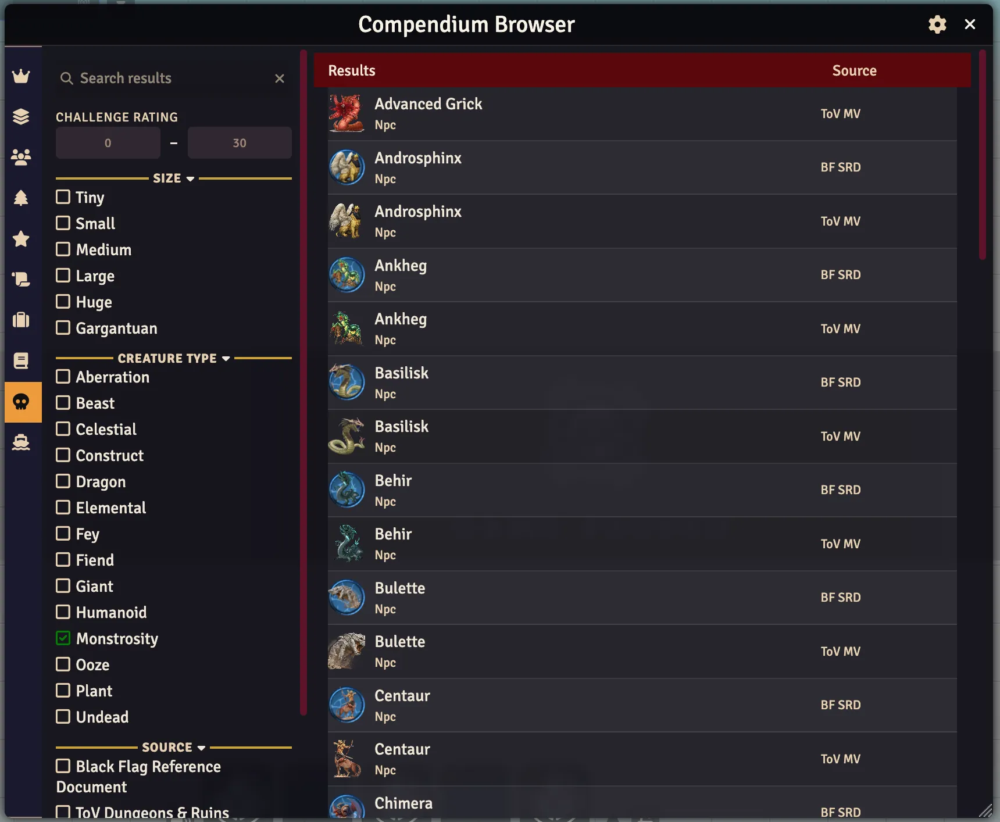

# Compendium Browser — Black Flag / Tales of the Valiant

> **⚠️ Disclaimer:** This module was created by an AI coding agent (Hephaestus, via Hermes Agent) under the direction of Jon Michaels. While tested and functional, users should verify behavior in their own games before relying on it in critical sessions.

[](https://foundryvtt.com)
[](https://github.com/koboldpress/black-flag)
[](https://github.com/jonmichaels/compendium-browser-bf/releases)

A compendium browser for [Black Flag Roleplaying (Tales of the Valiant)](https://koboldpress.com/tales-of-the-valiant/). Browse and filter spells, items, monsters, classes, lineages, heritages, talents, and more. Ported from the dnd5e built-in compendium browser.



## Features

| Feature | Description |
|---------|-------------|
| **10 tabs** | Classes, Subclasses, Lineages, Heritages, Talents, Backgrounds, Items, Spells, Monsters, Vehicles |
| **Rich filtering** | Tab-specific sidebar filters — class, rarity, spell circle, school, magic source, tags, CR, size, creature type, price |
| **3-state filters** | Toggle between off → include (green ✓) → exclude (red −) → off |
| **Type checkboxes** | Filter by item subtypes on tabs that support them |
| **Name search** | Debounced text search across compendium indexes |
| **Source configuration** | GM-configurable compendium source selection per package |
| **Drag-and-drop** | Drag entries directly into actor sheets or the sidebar |
| **Lazy loading** | Scroll to load more results in large collections |
| **Document preview** | Click any entry title to open its full document sheet |
| **Row dividers** | Subtle gray lines between result rows for readability |
| **Hover glow** | Visual feedback on search and filter inputs |
| **Hotkey toggle** | `Shift+Alt+B` opens or closes the browser from anywhere in Foundry |

## Installation

**In Foundry VTT:**
1. Go to **Add-on Modules** → **Install Module**
2. Paste the manifest URL: `https://github.com/jonmichaels/compendium-browser-bf/releases/latest/download/module.json`
3. Click **Install**

**Manual:**
Download the latest release zip and extract to `Data/modules/compendium-browser-bf/`.

## Requirements

- **Foundry VTT** v13+
- **Black Flag Roleplaying** (Tales of the Valiant) system v2.0+

## How It Works

1. Activate the module in your world's Module Management
2. Open the Compendium Packs sidebar
3. Click the **📖 Open Compendium Browser** button at the top
4. Select a tab — the sidebar loads filters relevant to that content type
5. Use the sidebar to filter results or search by name
6. Click an entry title to open its full document sheet

Filters are tab-specific and resolve from the compendium index for fast filtering. Class filter on the Subclasses screen loads full documents for accurate parent class matching.

## Development

```bash
npm install
npm run build    # production build (webpack)
npm run watch    # development watch mode
```

Symlink the project directory into Foundry's `Data/modules/compendium-browser-bf/` for live testing.

## Credits

This module is a Black Flag / Tales of the Valiant port of the dnd5e built-in compendium browser.

- **Original dnd5e compendium browser:** [foundryvtt/dnd5e](https://github.com/foundryvtt/dnd5e) — built into the dnd5e system
- **Black Flag port:** Jon Michaels, coded by Hephaestus (AI agent via Hermes Agent)

## License

MIT
